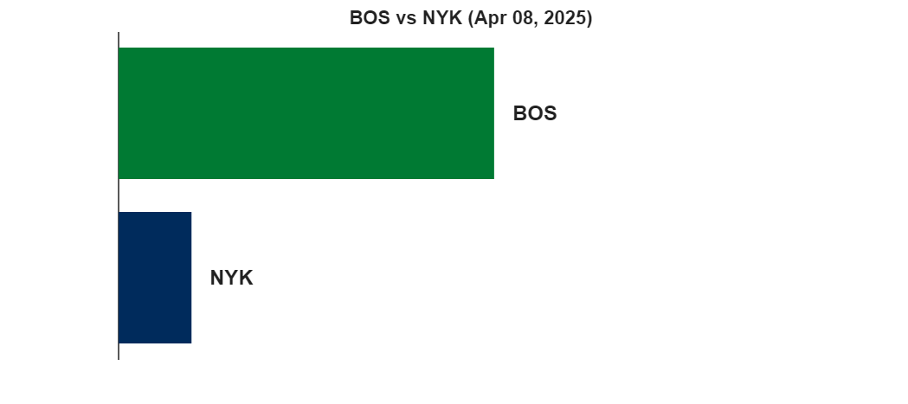

# Basket 🏀

Use MATLAB with Python to play with NBA data

https://github.com/user-attachments/assets/a6ad44f3-d82a-4777-b401-bb4ef405e393

<a name="beginToc"></a>

## Table of Contents
&emsp;&emsp;[Players](#players)
 
&emsp;&emsp;[Teams](#teams)
 
&emsp;&emsp;[Games](#games)
 
&emsp;&emsp;[Ranking](#ranking)
 
&emsp;&emsp;[Utils](#utils)
 
<a name="endToc"></a>

**Resources**

-  [https://github.com/swar/nba\_api](https://github.com/swar/nba_api)  

## Players
```matlab
player_id = 1628369; % jayson tatum
image_url = "https://ak-static.cms.nba.com/wp-content/uploads/headshots/nba/latest/260x190/"+player_id+".png";
[im, cmap] = imread(image_url);
imshow(im,cmap)
```


```matlab
career = py.nba_api.stats.endpoints.playercareerstats.PlayerCareerStats(player_id=string(player_id));
c = career.get_data_frames();
table(c{1})
```
| |PLAYER_ID|SEASON_ID|LEAGUE_ID|TEAM_ID|TEAM_ABBREVIATION|PLAYER_AGE|GP|GS|MIN|FGM|FGA|FG_PCT|FG3M|FG3A|FG3_PCT|FTM|FTA|FT_PCT|OREB|DREB|REB|AST|STL|BLK|TOV|PF|PTS|
|:--:|:--:|:--:|:--:|:--:|:--:|:--:|:--:|:--:|:--:|:--:|:--:|:--:|:--:|:--:|:--:|:--:|:--:|:--:|:--:|:--:|:--:|:--:|:--:|:--:|:--:|:--:|:--:|
|1|1628369|"2017-18"|"00"|1610612738|"BOS"|20|80|80|2443|397|835|0.4750|105|242|0.4340|213|258|0.8260|50|352|402|128|83|58|114|170|1112|
|2|1628369|"2018-19"|"00"|1610612738|"BOS"|21|79|79|2455|466|1036|0.4500|116|311|0.3730|195|228|0.8550|70|407|477|168|84|57|122|168|1243|
|3|1628369|"2019-20"|"00"|1610612738|"BOS"|22|66|66|2265|552|1226|0.4500|189|469|0.4030|254|313|0.8120|64|396|460|200|93|57|155|136|1547|
|4|1628369|"2020-21"|"00"|1610612738|"BOS"|23|64|64|2290|605|1318|0.4590|187|485|0.3860|295|340|0.8680|50|422|472|276|75|31|171|122|1692|
|5|1628369|"2021-22"|"00"|1610612738|"BOS"|24|76|76|2731|708|1564|0.4530|230|651|0.3530|400|469|0.8530|85|524|609|334|75|49|217|174|2046|
|6|1628369|"2022-23"|"00"|1610612738|"BOS"|25|74|74|2732|727|1559|0.4660|240|686|0.3500|531|622|0.8540|78|571|649|342|78|51|213|160|2225|
|7|1628369|"2023-24"|"00"|1610612738|"BOS"|26|74|74|2645|672|1426|0.4710|229|609|0.3760|414|497|0.8330|67|534|601|364|75|43|188|145|1987|
|8|1628369|"2024-25"|"00"|1610612738|"BOS"|27|72|72|2624|662|1465|0.4520|250|728|0.3430|358|440|0.8140|48|575|623|431|76|38|209|157|1932|

## Teams
```matlab
% get_teams returns a list of 30 dictionaries, each an NBA team.
nba_teams = py.nba_api.stats.static.teams.get_teams()
```

```matlabTextOutput
nba_teams = 
  Python list with values:

    [{'id': 1610612737, 'full_name': 'Atlanta Hawks', 'abbreviation': 'ATL', 'nickname': 'Hawks', 'city': 'Atlanta', 'state': 'Georgia', 'year_founded': 1949}, {'id': 1610612738, 'full_name': 'Boston Celtics', 'abbreviation': 'BOS', 'nickname': 'Celtics', 'city': 'Boston', 'state': 'Massachusetts', 'year_founded': 1946}, {'id': 1610612739, 'full_name': 'Cleveland Cavaliers', 'abbreviation': 'CLE', 'nickname': 'Cavaliers', 'city': 'Cleveland', 'state': 'Ohio', 'year_founded': 1970}, {'id': 1610612740, 'full_name': 'New Orleans Pelicans', 'abbreviation': 'NOP', 'nickname': 'Pelicans', 'city': 'New Orleans', 'state': 'Louisiana', 'year_founded': 2002}, {'id': 1610612741, 'full_name': 'Chicago Bulls', 'abbreviation': 'CHI', 'nickname': 'Bulls', 'city': 'Chicago', 'state': 'Illinois', 'year_founded': 1966}, {'id': 1610612742, 'full_name': 'Dallas Mavericks', 'abbreviation': 'DAL', 'nickname': 'Mavericks', 'city': 'Dallas', 'state': 'Texas', 'year_founded': 1980}, {'id': 1610612743, 'full_name': 'Denver Nuggets', 'abbreviation': 'DEN', 'nickname': 'Nuggets', 'city': 'Denver', 'state': 'Colorado', 'year_founded': 1976}, {'id': 1610612744, 'full_name': 'Golden State Warriors', 'abbreviation': 'GSW', 'nickname': 'Warriors', 'city': 'Golden State', 'state': 'California', 'year_founded': 1946}, {'id': 1610612745, 'full_name': 'Houston Rockets', 'abbreviation': 'HOU', 'nickname': 'Rockets', 'city': 'Houston', 'state': 'Texas', 'year_founded': 1967}, {'id': 1610612746, 'full_name': 'Los Angeles Clippers', 'abbreviation': 'LAC', 'nickname': 'Clippers', 'city': 'Los Angeles', 'state': 'California', 'year_founded': 1970}, {'id': 1610612747, 'full_name': 'Los Angeles Lakers', 'abbreviation': 'LAL', 'nickname': 'Lakers', 'city': 'Los Angeles', 'state': 'California', 'year_founded': 1948}, {'id': 1610612748, 'full_name': 'Miami Heat', 'abbreviation': 'MIA', 'nickname': 'Heat', 'city': 'Miami', 'state': 'Florida', 'year_founded': 1988}, {'id': 1610612749, 'full_name': 'Milwaukee Bucks', 'abbreviation': 'MIL', 'nickname': 'Bucks', 'city': 'Milwaukee', 'state': 'Wisconsin', 'year_founded': 1968}, {'id': 1610612750, 'full_name': 'Minnesota Timberwolves', 'abbreviation': 'MIN', 'nickname': 'Timberwolves', 'city': 'Minnesota', 'state': 'Minnesota', 'year_founded': 1989}, {'id': 1610612751, 'full_name': 'Brooklyn Nets', 'abbreviation': 'BKN', 'nickname': 'Nets', 'city': 'Brooklyn', 'state': 'New York', 'year_founded': 1976}, {'id': 1610612752, 'full_name': 'New York Knicks', 'abbreviation': 'NYK', 'nickname': 'Knicks', 'city': 'New York', 'state': 'New York', 'year_founded': 1946}, {'id': 1610612753, 'full_name': 'Orlando Magic', 'abbreviation': 'ORL', 'nickname': 'Magic', 'city': 'Orlando', 'state': 'Florida', 'year_founded': 1989}, {'id': 1610612754, 'full_name': 'Indiana Pacers', 'abbreviation': 'IND', 'nickname': 'Pacers', 'city': 'Indiana', 'state': 'Indiana', 'year_founded': 1976}, {'id': 1610612755, 'full_name': 'Philadelphia 76ers', 'abbreviation': 'PHI', 'nickname': '76ers', 'city': 'Philadelphia', 'state': 'Pennsylvania', 'year_founded': 1949}, {'id': 1610612756, 'full_name': 'Phoenix Suns', 'abbreviation': 'PHX', 'nickname': 'Suns', 'city': 'Phoenix', 'state': 'Arizona', 'year_founded': 1968}, {'id': 1610612757, 'full_name': 'Portland Trail Blazers', 'abbreviation': 'POR', 'nickname': 'Trail Blazers', 'city': 'Portland', 'state': 'Oregon', 'year_founded': 1970}, {'id': 1610612758, 'full_name': 'Sacramento Kings', 'abbreviation': 'SAC', 'nickname': 'Kings', 'city': 'Sacramento', 'state': 'California', 'year_founded': 1948}, {'id': 1610612759, 'full_name': 'San Antonio Spurs', 'abbreviation': 'SAS', 'nickname': 'Spurs', 'city': 'San Antonio', 'state': 'Texas', 'year_founded': 1976}, {'id': 1610612760, 'full_name': 'Oklahoma City Thunder', 'abbreviation': 'OKC', 'nickname': 'Thunder', 'city': 'Oklahoma City', 'state': 'Oklahoma', 'year_founded': 1967}, {'id': 1610612761, 'full_name': 'Toronto Raptors', 'abbreviation': 'TOR', 'nickname': 'Raptors', 'city': 'Toronto', 'state': 'Ontario', 'year_founded': 1995}, {'id': 1610612762, 'full_name': 'Utah Jazz', 'abbreviation': 'UTA', 'nickname': 'Jazz', 'city': 'Utah', 'state': 'Utah', 'year_founded': 1974}, {'id': 1610612763, 'full_name': 'Memphis Grizzlies', 'abbreviation': 'MEM', 'nickname': 'Grizzlies', 'city': 'Memphis', 'state': 'Tennessee', 'year_founded': 1995}, {'id': 1610612764, 'full_name': 'Washington Wizards', 'abbreviation': 'WAS', 'nickname': 'Wizards', 'city': 'Washington', 'state': 'District of Columbia', 'year_founded': 1961}, {'id': 1610612765, 'full_name': 'Detroit Pistons', 'abbreviation': 'DET', 'nickname': 'Pistons', 'city': 'Detroit', 'state': 'Michigan', 'year_founded': 1948}, {'id': 1610612766, 'full_name': 'Charlotte Hornets', 'abbreviation': 'CHA', 'nickname': 'Hornets', 'city': 'Charlotte', 'state': 'North Carolina', 'year_founded': 1988}]

    Use string, double or cell function to convert to a MATLAB array.

```

```matlab
T = table(py.pandas.DataFrame(nba_teams))
```
| |id|full_name|abbreviation|nickname|city|state|year_founded|
|:--:|:--:|:--:|:--:|:--:|:--:|:--:|:--:|
|1|1610612737|"Atlanta Hawks"|"ATL"|"Hawks"|"Atlanta"|"Georgia"|1949|
|2|1610612738|"Boston Celtics"|"BOS"|"Celtics"|"Boston"|"Massachusetts"|1946|
|3|1610612739|"Cleveland Cavaliers"|"CLE"|"Cavaliers"|"Cleveland"|"Ohio"|1970|
|4|1610612740|"New Orleans Pelicans"|"NOP"|"Pelicans"|"New Orleans"|"Louisiana"|2002|
|5|1610612741|"Chicago Bulls"|"CHI"|"Bulls"|"Chicago"|"Illinois"|1966|
|6|1610612742|"Dallas Mavericks"|"DAL"|"Mavericks"|"Dallas"|"Texas"|1980|
|7|1610612743|"Denver Nuggets"|"DEN"|"Nuggets"|"Denver"|"Colorado"|1976|
|8|1610612744|"Golden State Warriors"|"GSW"|"Warriors"|"Golden State"|"California"|1946|
|9|1610612745|"Houston Rockets"|"HOU"|"Rockets"|"Houston"|"Texas"|1967|
|10|1610612746|"Los Angeles Clippers"|"LAC"|"Clippers"|"Los Angeles"|"California"|1970|
|11|1610612747|"Los Angeles Lakers"|"LAL"|"Lakers"|"Los Angeles"|"California"|1948|
|12|1610612748|"Miami Heat"|"MIA"|"Heat"|"Miami"|"Florida"|1988|
|13|1610612749|"Milwaukee Bucks"|"MIL"|"Bucks"|"Milwaukee"|"Wisconsin"|1968|
|14|1610612750|"Minnesota Timberwolves"|"MIN"|"Timberwolves"|"Minnesota"|"Minnesota"|1989|

```matlab
teams = T.abbreviation;
team = teams(2);
team_id = T{teams == team,"id"};
% team_id = 1610612738 % celtics https://www.nba.com/stats/team/1610612738
game_log = py.nba_api.stats.endpoints.teamgamelog.TeamGameLog(team_id=team_id, season='2024-25').get_data_frames();
table(game_log{1})
```
| |Team_ID|Game_ID|GAME_DATE|MATCHUP|WL|W|L|W_PCT|MIN|FGM|FGA|FG_PCT|FG3M|FG3A|FG3_PCT|FTM|FTA|FT_PCT|OREB|DREB|REB|AST|STL|BLK|TOV|PF|PTS|
|:--:|:--:|:--:|:--:|:--:|:--:|:--:|:--:|:--:|:--:|:--:|:--:|:--:|:--:|:--:|:--:|:--:|:--:|:--:|:--:|:--:|:--:|:--:|:--:|:--:|:--:|:--:|:--:|
|1|1610612738|"0022401187"|"APR 13, 2025"|"BOS vs. CHA"|"W"|61|21|0.7440|240|35|90|0.3890|14|45|0.3110|9|13|0.6920|15|34|49|22|12|6|13|14|93|
|2|1610612738|"0022401174"|"APR 11, 2025"|"BOS vs. CHA"|"W"|60|21|0.7410|240|49|95|0.5160|23|51|0.4510|9|12|0.7500|10|42|52|35|9|8|10|11|130|
|3|1610612738|"0022401156"|"APR 09, 2025"|"BOS @ ORL"|"L"|59|21|0.7380|240|32|82|0.3900|7|40|0.1750|5|6|0.8330|9|34|43|20|5|5|15|11|76|
|4|1610612738|"0022401151"|"APR 08, 2025"|"BOS @ NYK"|"W"|59|20|0.7470|265|40|87|0.4600|19|49|0.3880|20|25|0.8000|9|29|38|26|8|4|15|17|119|
|5|1610612738|"0022401137"|"APR 06, 2025"|"BOS vs. WAS"|"W"|58|20|0.7440|240|48|98|0.4900|24|52|0.4620|4|6|0.6670|25|37|62|33|6|5|13|9|124|
|6|1610612738|"0022401120"|"APR 04, 2025"|"BOS vs. PHX"|"W"|57|20|0.7400|240|45|87|0.5170|14|39|0.3590|19|22|0.8640|10|39|49|28|1|4|7|13|123|
|7|1610612738|"0022401106"|"APR 02, 2025"|"BOS vs. MIA"|"L"|56|20|0.7370|240|39|87|0.4480|12|43|0.2790|13|16|0.8130|19|24|43|24|3|6|13|17|103|
|8|1610612738|"0022401093"|"MAR 31, 2025"|"BOS @ MEM"|"W"|56|19|0.7470|240|39|96|0.4060|21|62|0.3390|18|19|0.9470|12|42|54|30|4|3|12|11|117|
|9|1610612738|"0022401080"|"MAR 29, 2025"|"BOS @ SAS"|"W"|55|19|0.7430|240|45|94|0.4790|17|51|0.3330|14|18|0.7780|15|39|54|32|2|4|9|18|121|
|10|1610612738|"0022401058"|"MAR 26, 2025"|"BOS @ PHX"|"W"|54|19|0.7400|240|45|89|0.5060|22|52|0.4230|20|22|0.9090|11|37|48|33|8|7|10|18|132|
|11|1610612738|"0022401044"|"MAR 24, 2025"|"BOS @ SAC"|"W"|53|19|0.7360|240|41|90|0.4560|19|50|0.3800|12|20|0.6000|10|35|45|28|9|4|10|14|113|
|12|1610612738|"0022401034"|"MAR 23, 2025"|"BOS @ POR"|"W"|52|19|0.7320|240|48|88|0.5450|23|50|0.4600|10|14|0.7140|11|27|38|31|6|6|9|14|129|
|13|1610612738|"0022401020"|"MAR 21, 2025"|"BOS @ UTA"|"W"|51|19|0.7290|240|45|97|0.4640|17|51|0.3330|14|16|0.8750|16|32|48|27|13|4|10|15|121|
|14|1610612738|"0022400994"|"MAR 18, 2025"|"BOS vs. BKN"|"W"|50|19|0.7250|240|35|79|0.4430|16|48|0.3330|18|22|0.8180|6|42|48|24|6|5|13|14|104|

## Games
```matlab
season = "2024-25";
```

```matlab
% Python code input
pycode = [...
"from nba_api.stats.endpoints import LeagueGameLog",...
"gl = LeagueGameLog(season=season)",...
"games = gl.get_data_frames()[0]"...
];

try
    [games2] = pyrun(pycode, ...
         [ "games" ])
catch ME
    % Clear temporary variables from workspace and from Python
    clear pycode;
    rethrow(ME)
end
```

```matlabTextOutput
games2 = 
  Python DataFrame with properties:

          T: [1x1 py.pandas.core.frame.DataFrame]
         at: [1x1 py.pandas.core.indexing._AtIndexer]
      attrs: [1x1 py.dict]
       axes: [1x2 py.list]
    columns: [1x1 py.pandas.core.indexes.base.Index]
     dtypes: [1x1 py.pandas.core.series.Series]
      empty: 0
      flags: [1x1 py.pandas.core.flags.Flags]
        iat: [1x1 py.pandas.core.indexing._iAtIndexer]
       iloc: [1x1 py.pandas.core.indexing._iLocIndexer]
      index: [1x1 py.pandas.core.indexes.range.RangeIndex]
        loc: [1x1 py.pandas.core.indexing._LocIndexer]
       ndim: [1x1 py.int]
      shape: [1x2 py.tuple]
       size: [1x1 py.numpy.int32]
      style: [1x1 py.pandas.io.formats.style.Styler]
     values: [1x1 py.numpy.ndarray]

         SEASON_ID     TEAM_ID TEAM_ABBREVIATION  ...  PTS PLUS_MINUS VIDEO_AVAILABLE
    0        22024  1610612752               NYK  ...  109        -23               1
    1        22024  1610612747               LAL  ...  110          7               1
    2        22024  1610612738               BOS  ...  132         23               1
    3        22024  1610612750               MIN  ...  103         -7               1
    4        22024  1610612765               DET  ...  109         -6               1
    ...        ...         ...               ...  ...  ...        ...             ...
    2455     22024  1610612741               CHI  ...  122         20               1
    2456     22024  1610612737               ATL  ...  117         12               1
    2457     22024  1610612755               PHI  ...  102        -20               1
    2458     22024  1610612753               ORL  ...  105        -12               1
    2459     22024  1610612748               MIA  ...  118         -1               1
    
    [2460 rows x 29 columns]

```

```matlab

% Clear temporary variables from workspace and from Python
clear pycode;
table(games2)
```
| |SEASON_ID|TEAM_ID|TEAM_ABBREVIATION|TEAM_NAME|GAME_ID|GAME_DATE|MATCHUP|WL|MIN|FGM|FGA|FG_PCT|FG3M|FG3A|FG3_PCT|FTM|FTA|FT_PCT|OREB|DREB|REB|AST|STL|BLK|TOV|PF|PTS|PLUS_MINUS|VIDEO_AVAILABLE|
|:--:|:--:|:--:|:--:|:--:|:--:|:--:|:--:|:--:|:--:|:--:|:--:|:--:|:--:|:--:|:--:|:--:|:--:|:--:|:--:|:--:|:--:|:--:|:--:|:--:|:--:|:--:|:--:|:--:|:--:|
|1|"22024"|1610612752|"NYK"|"New York Knicks"|"0022400061"|"2024-10-22"|"NYK @ BOS"|"L"|240|43|78|0.5510|11|30|0.3670|12|16|0.7500|5|29|34|20|2|3|12|12|109|-23|1|
|2|"22024"|1610612747|"LAL"|"Los Angeles Lakers"|"0022400062"|"2024-10-22"|"LAL vs. MIN"|"W"|240|42|95|0.4420|5|30|0.1670|21|25|0.8400|15|31|46|22|7|8|7|22|110|7|1|
|3|"22024"|1610612738|"BOS"|"Boston Celtics"|"0022400061"|"2024-10-22"|"BOS vs. NYK"|"W"|240|48|95|0.5050|29|61|0.4750|7|8|0.8750|11|29|40|33|6|3|4|15|132|23|1|
|4|"22024"|1610612750|"MIN"|"Minnesota Timberwolves"|"0022400062"|"2024-10-22"|"MIN @ LAL"|"L"|240|35|85|0.4120|13|41|0.3170|20|27|0.7410|12|35|47|17|4|1|16|22|103|-7|1|
|5|"22024"|1610612765|"DET"|"Detroit Pistons"|"0022400063"|"2024-10-23"|"DET vs. IND"|"L"|240|38|88|0.4320|9|33|0.2730|24|28|0.8570|12|26|38|22|6|2|14|21|109|-6|1|
|6|"22024"|1610612755|"PHI"|"Philadelphia 76ers"|"0022400066"|"2024-10-23"|"PHI vs. MIL"|"L"|240|41|98|0.4180|8|31|0.2580|19|27|0.7040|17|32|49|18|4|2|10|28|109|-15|1|
|7|"22024"|1610612749|"MIL"|"Milwaukee Bucks"|"0022400066"|"2024-10-23"|"MIL @ PHI"|"W"|240|43|80|0.5380|16|37|0.4320|22|31|0.7100|8|38|46|27|4|9|14|23|124|15|1|
|8|"22024"|1610612744|"GSW"|"Golden State Warriors"|"0022400072"|"2024-10-23"|"GSW @ POR"|"W"|240|48|93|0.5160|20|48|0.4170|24|30|0.8000|15|42|57|38|13|5|18|27|140|36|1|
|9|"22024"|1610612763|"MEM"|"Memphis Grizzlies"|"0022400070"|"2024-10-23"|"MEM @ UTA"|"W"|240|43|91|0.4730|17|45|0.3780|23|32|0.7190|13|28|41|28|7|5|13|35|126|2|1|
|10|"22024"|1610612756|"PHX"|"Phoenix Suns"|"0022400071"|"2024-10-23"|"PHX @ LAC"|"W"|265|38|78|0.4870|15|38|0.3950|25|34|0.7350|4|38|42|25|12|9|22|23|116|3|1|
|11|"22024"|1610612746|"LAC"|"LA Clippers"|"0022400071"|"2024-10-23"|"LAC vs. PHX"|"L"|265|42|92|0.4570|8|29|0.2760|21|30|0.7000|13|38|51|27|9|1|22|29|113|-3|1|
|12|"22024"|1610612762|"UTA"|"Utah Jazz"|"0022400070"|"2024-10-23"|"UTA vs. MEM"|"L"|240|40|85|0.4710|10|26|0.3850|34|45|0.7560|14|35|49|21|7|9|17|24|124|-2|1|
|13|"22024"|1610612740|"NOP"|"New Orleans Pelicans"|"0022400069"|"2024-10-23"|"NOP vs. CHI"|"W"|240|45|97|0.4640|14|37|0.3780|19|21|0.9050|7|35|42|29|15|10|12|17|123|12|1|
|14|"22024"|1610612737|"ATL"|"Atlanta Hawks"|"0022400064"|"2024-10-23"|"ATL vs. BKN"|"W"|240|39|80|0.4880|9|28|0.3210|33|46|0.7170|12|33|45|25|12|9|16|20|120|4|1|

## Ranking

**Elo rating** is a method for calculating the  *relative skill levels* of players and teams in competitor\-vs\-competitor games like chess, and it has been adapted for many sports, including **basketball.**

```matlab
nba_elo_BOS_NYK
```



```matlab
% NYK vs. BOS
game = readtable("BOS_vs_NYK_pre.csv", TextType="string");

% Extract the two Elo ratings (row is NYK vs BOS)
elo = struct();
elo.NYK = int64(game.elo_pre(1));        % NYK’s rating before the tip-off
elo.BOS = int64(game.elo_opp_pre(1));    % BOS’s rating before the tip-off

disp(elo)
```

```matlabTextOutput
    NYK: 1595
    BOS: 1678
```

Probability and odds

```matlab
p = calculate_win_probability(elo.BOS, elo.NYK)
```

```matlabTextOutput
p = 0.6172
```

```matlab
odds = probability_to_odds(p)
```

```matlabTextOutput
odds = 1.6202
```

Update the ELO rating after the game

```matlab
tname = "NYK";
oname = "BOS";

% pre-game ratings
r_team = elo.(tname);
r_opp  = elo.(oname);

% win indicator
win = 0;
exp_t  = 1/(1 + 10^((r_opp - r_team)/400));
K = 20;

% updates
elo.(tname) = elo.(tname) + K*( win        - exp_t);
elo.(oname) = elo.(oname) + K*((1-win) - (1-exp_t));
disp(elo)
```

```matlabTextOutput
    NYK: 1575
    BOS: 1698
```

## Utils
```matlab
function p = calculate_win_probability(elo_a, elo_b)
    % Compute win probability for team A given two Elo ratings
    p = 1 / (1 + 10^((elo_b - elo_a) / 400));
end

function odds = probability_to_odds(probability)
    % Convert probability to decimal odds
    odds = 1 / probability;
end
```
