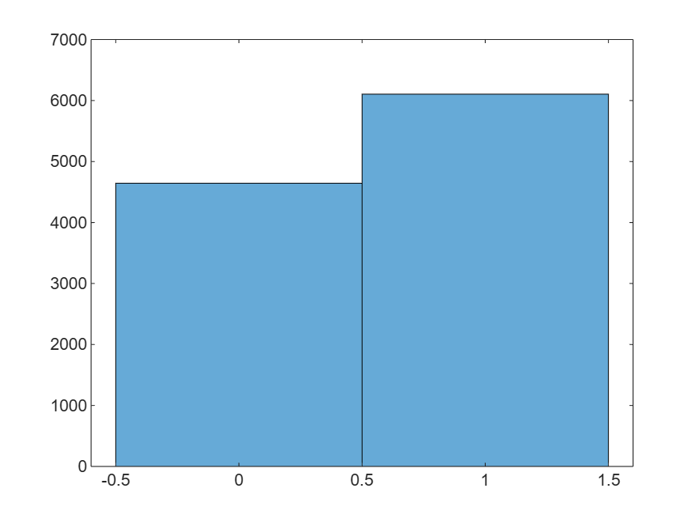

# Basket

Use MATLAB with Python to play with NBA data

https://github.com/user-attachments/assets/a6ad44f3-d82a-4777-b401-bb4ef405e393

<a name="beginToc"></a>

## Table of Contents
&emsp;&emsp;[Players](#players)
 
&emsp;&emsp;[Teams](#teams)
 
&emsp;&emsp;[Games](#games)
 
<a name="endToc"></a>

**Resources**

-  [https://github.com/swar/nba\_api](https://github.com/swar/nba_api)  

## Players
```matlab
player_id = 1628369; % jayson tatum
image_url = "https://ak-static.cms.nba.com/wp-content/uploads/headshots/nba/latest/260x190/"+player_id+".png";
[im, cmap] = imread(image_url);
imshow(im,cmap)
```



```matlab
career = py.nba_api.stats.endpoints.playercareerstats.PlayerCareerStats(player_id="203076");
c = career.get_data_frames();
table(c{1})
```
| |PLAYER_ID|SEASON_ID|LEAGUE_ID|TEAM_ID|TEAM_ABBREVIATION|PLAYER_AGE|GP|GS|MIN|FGM|FGA|FG_PCT|FG3M|FG3A|FG3_PCT|FTM|FTA|FT_PCT|OREB|DREB|REB|AST|STL|BLK|TOV|PF|PTS|
|:--:|:--:|:--:|:--:|:--:|:--:|:--:|:--:|:--:|:--:|:--:|:--:|:--:|:--:|:--:|:--:|:--:|:--:|:--:|:--:|:--:|:--:|:--:|:--:|:--:|:--:|:--:|:--:|
|1|203076|"2012-13"|"00"|1610612740|"NOH"|20|64|60|1846|349|676|0.5160|0|6|0|169|225|0.7510|165|357|522|63|75|112|89|158|867|
|2|203076|"2013-14"|"00"|1610612740|"NOP"|21|67|66|2358|522|1005|0.5190|2|9|0.2220|348|440|0.7910|207|466|673|105|89|189|109|200|1394|
|3|203076|"2014-15"|"00"|1610612740|"NOP"|22|68|68|2455|642|1199|0.5350|1|12|0.0830|371|461|0.8050|173|523|696|149|100|200|95|141|1656|
|4|203076|"2015-16"|"00"|1610612740|"NOP"|23|61|61|2164|560|1136|0.4930|35|108|0.3240|326|430|0.7580|130|497|627|116|78|125|121|148|1481|
|5|203076|"2016-17"|"00"|1610612740|"NOP"|24|75|75|2708|770|1526|0.5050|40|134|0.2990|519|647|0.8020|172|712|884|157|94|167|181|168|2099|
|6|203076|"2017-18"|"00"|1610612740|"NOP"|25|75|75|2727|780|1462|0.5340|55|162|0.3400|495|598|0.8280|187|644|831|174|115|193|162|159|2110|
|7|203076|"2018-19"|"00"|1610612740|"NOP"|26|56|56|1850|530|1026|0.5170|48|145|0.3310|344|433|0.7940|174|498|672|218|88|135|112|132|1452|
|8|203076|"2019-20"|"00"|1610612747|"LAL"|27|62|62|2131|551|1096|0.5030|72|218|0.3300|444|525|0.8460|142|435|577|200|91|143|154|156|1618|
|9|203076|"2020-21"|"00"|1610612747|"LAL"|28|36|36|1162|301|613|0.4910|26|100|0.2600|158|214|0.7380|62|224|286|110|45|59|74|60|786|
|10|203076|"2021-22"|"00"|1610612747|"LAL"|29|40|40|1404|370|695|0.5320|13|70|0.1860|174|244|0.7130|106|288|394|122|49|90|82|97|927|
|11|203076|"2022-23"|"00"|1610612747|"LAL"|30|56|54|1905|542|962|0.5630|19|74|0.2570|348|444|0.7840|195|507|702|148|59|114|122|146|1451|
|12|203076|"2023-24"|"00"|1610612747|"LAL"|31|76|76|2700|713|1283|0.5560|29|107|0.2710|421|516|0.8160|239|722|961|266|91|178|159|177|1876|
|13|203076|"2024-25"|"00"|1610612747|"LAL"|32|42|42|1439|400|758|0.5280|28|94|0.2980|253|321|0.7880|119|380|499|141|54|90|93|82|1081|
|14|203076|"2024-25"|"00"|1610612742|"DAL"|32|9|9|266|70|152|0.4610|7|30|0.2330|33|48|0.6880|15|76|91|40|5|20|20|16|180|

## Teams
```matlab
% get_teams returns a list of 30 dictionaries, each an NBA team.
nba_teams = py.nba_api.stats.static.teams.get_teams()
```

```matlabTextOutput
nba_teams = 
  Python list with values:

    [{'id': 1610612737, 'full_name': 'Atlanta Hawks', 'abbreviation': 'ATL', 'nickname': 'Hawks', 'city': 'Atlanta', 'state': 'Georgia', 'year_founded': 1949}, {'id': 1610612738, 'full_name': 'Boston Celtics', 'abbreviation': 'BOS', 'nickname': 'Celtics', 'city': 'Boston', 'state': 'Massachusetts', 'year_founded': 1946}, {'id': 1610612739, 'full_name': 'Cleveland Cavaliers', 'abbreviation': 'CLE', 'nickname': 'Cavaliers', 'city': 'Cleveland', 'state': 'Ohio', 'year_founded': 1970}, {'id': 1610612740, 'full_name': 'New Orleans Pelicans', 'abbreviation': 'NOP', 'nickname': 'Pelicans', 'city': 'New Orleans', 'state': 'Louisiana', 'year_founded': 2002}, {'id': 1610612741, 'full_name': 'Chicago Bulls', 'abbreviation': 'CHI', 'nickname': 'Bulls', 'city': 'Chicago', 'state': 'Illinois', 'year_founded': 1966}, {'id': 1610612742, 'full_name': 'Dallas Mavericks', 'abbreviation': 'DAL', 'nickname': 'Mavericks', 'city': 'Dallas', 'state': 'Texas', 'year_founded': 1980}, {'id': 1610612743, 'full_name': 'Denver Nuggets', 'abbreviation': 'DEN', 'nickname': 'Nuggets', 'city': 'Denver', 'state': 'Colorado', 'year_founded': 1976}, {'id': 1610612744, 'full_name': 'Golden State Warriors', 'abbreviation': 'GSW', 'nickname': 'Warriors', 'city': 'Golden State', 'state': 'California', 'year_founded': 1946}, {'id': 1610612745, 'full_name': 'Houston Rockets', 'abbreviation': 'HOU', 'nickname': 'Rockets', 'city': 'Houston', 'state': 'Texas', 'year_founded': 1967}, {'id': 1610612746, 'full_name': 'Los Angeles Clippers', 'abbreviation': 'LAC', 'nickname': 'Clippers', 'city': 'Los Angeles', 'state': 'California', 'year_founded': 1970}, {'id': 1610612747, 'full_name': 'Los Angeles Lakers', 'abbreviation': 'LAL', 'nickname': 'Lakers', 'city': 'Los Angeles', 'state': 'California', 'year_founded': 1948}, {'id': 1610612748, 'full_name': 'Miami Heat', 'abbreviation': 'MIA', 'nickname': 'Heat', 'city': 'Miami', 'state': 'Florida', 'year_founded': 1988}, {'id': 1610612749, 'full_name': 'Milwaukee Bucks', 'abbreviation': 'MIL', 'nickname': 'Bucks', 'city': 'Milwaukee', 'state': 'Wisconsin', 'year_founded': 1968}, {'id': 1610612750, 'full_name': 'Minnesota Timberwolves', 'abbreviation': 'MIN', 'nickname': 'Timberwolves', 'city': 'Minnesota', 'state': 'Minnesota', 'year_founded': 1989}, {'id': 1610612751, 'full_name': 'Brooklyn Nets', 'abbreviation': 'BKN', 'nickname': 'Nets', 'city': 'Brooklyn', 'state': 'New York', 'year_founded': 1976}, {'id': 1610612752, 'full_name': 'New York Knicks', 'abbreviation': 'NYK', 'nickname': 'Knicks', 'city': 'New York', 'state': 'New York', 'year_founded': 1946}, {'id': 1610612753, 'full_name': 'Orlando Magic', 'abbreviation': 'ORL', 'nickname': 'Magic', 'city': 'Orlando', 'state': 'Florida', 'year_founded': 1989}, {'id': 1610612754, 'full_name': 'Indiana Pacers', 'abbreviation': 'IND', 'nickname': 'Pacers', 'city': 'Indiana', 'state': 'Indiana', 'year_founded': 1976}, {'id': 1610612755, 'full_name': 'Philadelphia 76ers', 'abbreviation': 'PHI', 'nickname': '76ers', 'city': 'Philadelphia', 'state': 'Pennsylvania', 'year_founded': 1949}, {'id': 1610612756, 'full_name': 'Phoenix Suns', 'abbreviation': 'PHX', 'nickname': 'Suns', 'city': 'Phoenix', 'state': 'Arizona', 'year_founded': 1968}, {'id': 1610612757, 'full_name': 'Portland Trail Blazers', 'abbreviation': 'POR', 'nickname': 'Trail Blazers', 'city': 'Portland', 'state': 'Oregon', 'year_founded': 1970}, {'id': 1610612758, 'full_name': 'Sacramento Kings', 'abbreviation': 'SAC', 'nickname': 'Kings', 'city': 'Sacramento', 'state': 'California', 'year_founded': 1948}, {'id': 1610612759, 'full_name': 'San Antonio Spurs', 'abbreviation': 'SAS', 'nickname': 'Spurs', 'city': 'San Antonio', 'state': 'Texas', 'year_founded': 1976}, {'id': 1610612760, 'full_name': 'Oklahoma City Thunder', 'abbreviation': 'OKC', 'nickname': 'Thunder', 'city': 'Oklahoma City', 'state': 'Oklahoma', 'year_founded': 1967}, {'id': 1610612761, 'full_name': 'Toronto Raptors', 'abbreviation': 'TOR', 'nickname': 'Raptors', 'city': 'Toronto', 'state': 'Ontario', 'year_founded': 1995}, {'id': 1610612762, 'full_name': 'Utah Jazz', 'abbreviation': 'UTA', 'nickname': 'Jazz', 'city': 'Utah', 'state': 'Utah', 'year_founded': 1974}, {'id': 1610612763, 'full_name': 'Memphis Grizzlies', 'abbreviation': 'MEM', 'nickname': 'Grizzlies', 'city': 'Memphis', 'state': 'Tennessee', 'year_founded': 1995}, {'id': 1610612764, 'full_name': 'Washington Wizards', 'abbreviation': 'WAS', 'nickname': 'Wizards', 'city': 'Washington', 'state': 'District of Columbia', 'year_founded': 1961}, {'id': 1610612765, 'full_name': 'Detroit Pistons', 'abbreviation': 'DET', 'nickname': 'Pistons', 'city': 'Detroit', 'state': 'Michigan', 'year_founded': 1948}, {'id': 1610612766, 'full_name': 'Charlotte Hornets', 'abbreviation': 'CHA', 'nickname': 'Hornets', 'city': 'Charlotte', 'state': 'North Carolina', 'year_founded': 1988}]

    Use string, double or cell function to convert to a MATLAB array.

```

```matlab
T = table(py.pandas.DataFrame(nba_teams))
```
| |id|full_name|abbreviation|nickname|city|state|year_founded|
|:--:|:--:|:--:|:--:|:--:|:--:|:--:|:--:|
|1|1610612737|"Atlanta Hawks"|"ATL"|"Hawks"|"Atlanta"|"Georgia"|1949|
|2|1610612738|"Boston Celtics"|"BOS"|"Celtics"|"Boston"|"Massachusetts"|1946|
|3|1610612739|"Cleveland Cavaliers"|"CLE"|"Cavaliers"|"Cleveland"|"Ohio"|1970|
|4|1610612740|"New Orleans Pelicans"|"NOP"|"Pelicans"|"New Orleans"|"Louisiana"|2002|
|5|1610612741|"Chicago Bulls"|"CHI"|"Bulls"|"Chicago"|"Illinois"|1966|
|6|1610612742|"Dallas Mavericks"|"DAL"|"Mavericks"|"Dallas"|"Texas"|1980|
|7|1610612743|"Denver Nuggets"|"DEN"|"Nuggets"|"Denver"|"Colorado"|1976|
|8|1610612744|"Golden State Warriors"|"GSW"|"Warriors"|"Golden State"|"California"|1946|
|9|1610612745|"Houston Rockets"|"HOU"|"Rockets"|"Houston"|"Texas"|1967|
|10|1610612746|"Los Angeles Clippers"|"LAC"|"Clippers"|"Los Angeles"|"California"|1970|
|11|1610612747|"Los Angeles Lakers"|"LAL"|"Lakers"|"Los Angeles"|"California"|1948|
|12|1610612748|"Miami Heat"|"MIA"|"Heat"|"Miami"|"Florida"|1988|
|13|1610612749|"Milwaukee Bucks"|"MIL"|"Bucks"|"Milwaukee"|"Wisconsin"|1968|
|14|1610612750|"Minnesota Timberwolves"|"MIN"|"Timberwolves"|"Minnesota"|"Minnesota"|1989|

```matlab
teams = T.abbreviation;
team = teams(1);
team_id = T{teams == team,"id"}
```

```matlabTextOutput
team_id = int641610612737
```

```matlab
% team_id = 1610612738 % celtics https://www.nba.com/stats/team/1610612738
game_log = py.nba_api.stats.endpoints.teamgamelog.TeamGameLog(team_id=team_id, season='2024-25').get_data_frames();
table(game_log{1})
```
| |Team_ID|Game_ID|GAME_DATE|MATCHUP|WL|W|L|W_PCT|MIN|FGM|FGA|FG_PCT|FG3M|FG3A|FG3_PCT|FTM|FTA|FT_PCT|OREB|DREB|REB|AST|STL|BLK|TOV|PF|PTS|
|:--:|:--:|:--:|:--:|:--:|:--:|:--:|:--:|:--:|:--:|:--:|:--:|:--:|:--:|:--:|:--:|:--:|:--:|:--:|:--:|:--:|:--:|:--:|:--:|:--:|:--:|:--:|:--:|
|1|1610612737|"0022401186"|"APR 13, 2025"|"ATL vs. ORL"|"W"|40|42|0.4880|240|47|88|0.5340|17|40|0.4250|6|10|0.6000|9|35|44|32|8|2|15|15|117|
|2|1610612737|"0022401173"|"APR 11, 2025"|"ATL @ PHI"|"W"|39|42|0.4810|240|45|94|0.4790|16|42|0.3810|18|24|0.7500|18|35|53|28|9|5|14|15|124|
|3|1610612737|"0022401169"|"APR 10, 2025"|"ATL @ BKN"|"W"|38|42|0.4750|240|48|84|0.5710|15|36|0.4170|22|33|0.6670|7|44|51|36|11|1|15|19|133|
|4|1610612737|"0022401149"|"APR 08, 2025"|"ATL @ ORL"|"L"|37|42|0.4680|240|40|88|0.4550|14|41|0.3410|18|22|0.8180|14|27|41|25|7|6|18|26|112|
|5|1610612737|"0022401136"|"APR 06, 2025"|"ATL vs. UTA"|"W"|37|41|0.4740|240|54|95|0.5680|22|41|0.5370|17|20|0.8500|11|31|42|43|7|3|11|19|147|
|6|1610612737|"0022401128"|"APR 05, 2025"|"ATL vs. NYK"|"L"|36|41|0.4680|240|41|88|0.4660|14|45|0.3110|9|12|0.7500|9|29|38|24|11|7|15|18|105|
|7|1610612737|"0022401109"|"APR 02, 2025"|"ATL @ DAL"|"L"|36|40|0.4740|240|42|97|0.4330|15|39|0.3850|19|22|0.8640|12|31|43|29|7|3|11|19|118|
|8|1610612737|"0022401097"|"APR 01, 2025"|"ATL vs. POR"|"L"|36|39|0.4800|240|41|92|0.4460|7|32|0.2190|24|28|0.8570|12|33|45|26|12|8|19|22|113|
|9|1610612737|"0022401083"|"MAR 30, 2025"|"ATL @ MIL"|"W"|36|38|0.4860|240|50|94|0.5320|17|48|0.3540|28|35|0.8000|15|31|46|36|10|2|8|29|145|
|10|1610612737|"0022401062"|"MAR 27, 2025"|"ATL @ MIA"|"L"|35|38|0.4790|240|43|83|0.5180|18|41|0.4390|8|11|0.7270|6|30|36|27|10|2|15|11|112|
|11|1610612737|"0022401049"|"MAR 25, 2025"|"ATL @ HOU"|"L"|35|37|0.4860|240|43|103|0.4170|15|49|0.3060|13|15|0.8670|18|24|42|32|8|1|14|26|114|
|12|1610612737|"0022401031"|"MAR 23, 2025"|"ATL vs. PHI"|"W"|35|36|0.4930|240|48|87|0.5520|17|37|0.4590|19|22|0.8640|10|29|39|35|11|4|16|26|132|
|13|1610612737|"0022401025"|"MAR 22, 2025"|"ATL vs. GSW"|"W"|34|36|0.4860|240|49|86|0.5700|15|36|0.4170|11|18|0.6110|10|36|46|37|5|3|14|23|124|
|14|1610612737|"0022400993"|"MAR 18, 2025"|"ATL @ CHA"|"W"|33|36|0.4780|240|50|93|0.5380|22|45|0.4890|12|15|0.8000|11|35|46|27|12|8|10|17|134|

## Games
```matlab
% Python code input
pycode = [...
"from nba_api.stats.endpoints import leaguegamefinder",...
"league_game_finder = leaguegamefinder.LeagueGameFinder(league_id_nullable='00', season_nullable='2024-25')",...
"games = league_game_finder.get_data_frames()[0]"...
];

try
    [games2] = pyrun(pycode, ...
         [ "games" ])
catch ME
    % Clear temporary variables from workspace and from Python
    clear pycode;
    rethrow(ME)
end
```

```matlabTextOutput
games2 = 
  Python DataFrame with properties:

          T: [1x1 py.pandas.core.frame.DataFrame]
         at: [1x1 py.pandas.core.indexing._AtIndexer]
      attrs: [1x1 py.dict]
       axes: [1x2 py.list]
    columns: [1x1 py.pandas.core.indexes.base.Index]
     dtypes: [1x1 py.pandas.core.series.Series]
      empty: 0
      flags: [1x1 py.pandas.core.flags.Flags]
        iat: [1x1 py.pandas.core.indexing._iAtIndexer]
       iloc: [1x1 py.pandas.core.indexing._iLocIndexer]
      index: [1x1 py.pandas.core.indexes.range.RangeIndex]
        loc: [1x1 py.pandas.core.indexing._LocIndexer]
       ndim: [1x1 py.int]
      shape: [1x2 py.tuple]
       size: [1x1 py.numpy.int32]
      style: [1x1 py.pandas.io.formats.style.Styler]
     values: [1x1 py.numpy.ndarray]

         SEASON_ID     TEAM_ID TEAM_ABBREVIATION  ... TOV  PF PLUS_MINUS
    0        42024  1610612760               OKC  ...  13  20       16.0
    1        42024  1610612754               IND  ...  15  25      -16.0
    2        42024  1610612760               OKC  ...   6  19       -1.0
    3        42024  1610612754               IND  ...  24  22        1.0
    4        42024  1610612754               IND  ...  12  23       17.0
    ...        ...         ...               ...  ...  ..  ..        ...
    2787     12024  1610612747               LAL  ...  20  20      -17.0
    2788     12024  1610612743               DEN  ...  23  24       -4.0
    2789     12024  1610612738               BOS  ...  17  24        4.0
    2790     12024  1610612750               MIN  ...  14  19       17.0
    2791     12024  1610612762               UTA  ...  21  19       29.0
    
    [2792 rows x 28 columns]

```

```matlab

% Clear temporary variables from workspace and from Python
clear pycode;
table(games2)
```
| |SEASON_ID|TEAM_ID|TEAM_ABBREVIATION|TEAM_NAME|GAME_ID|GAME_DATE|MATCHUP|WL|MIN|PTS|FGM|FGA|FG_PCT|FG3M|FG3A|FG3_PCT|FTM|FTA|FT_PCT|OREB|DREB|REB|AST|STL|BLK|TOV|PF|PLUS_MINUS|
|:--:|:--:|:--:|:--:|:--:|:--:|:--:|:--:|:--:|:--:|:--:|:--:|:--:|:--:|:--:|:--:|:--:|:--:|:--:|:--:|:--:|:--:|:--:|:--:|:--:|:--:|:--:|:--:|:--:|
|1|"42024"|1610612760|"OKC"|"Oklahoma City Thunder"|"0042400402"|"2025-06-08"|"OKC vs. IND"|"W"|240|123|40|82|0.4880|14|36|0.3890|29|33|0.8790|11|32|43|25|10|4|13|20|16|
|2|"42024"|1610612754|"IND"|"Indiana Pacers"|"0042400402"|"2025-06-08"|"IND @ OKC"|"L"|241|107|37|82|0.4510|14|40|0.3500|19|26|0.7310|7|28|35|27|9|6|15|25|-16|
|3|"42024"|1610612760|"OKC"|"Oklahoma City Thunder"|"0042400401"|"2025-06-05"|"OKC vs. IND"|"L"|239|110|39|98|0.3980|11|30|0.3670|21|24|0.8750|10|29|39|13|14|6|6|19|-1|
|4|"42024"|1610612754|"IND"|"Indiana Pacers"|"0042400401"|"2025-06-05"|"IND @ OKC"|"W"|240|111|39|82|0.4760|18|39|0.4620|15|21|0.7140|13|43|56|24|1|7|24|22|1|
|5|"42024"|1610612754|"IND"|"Indiana Pacers"|"0042400306"|"2025-05-31"|"IND vs. NYK"|"W"|241|125|46|85|0.5410|17|33|0.5150|16|19|0.8420|6|30|36|30|10|9|12|23|17|
|6|"42024"|1610612752|"NYK"|"New York Knicks"|"0042400306"|"2025-05-31"|"NYK @ IND"|"L"|240|108|41|86|0.4770|9|32|0.2810|17|26|0.6540|13|28|41|23|10|6|17|16|-17|
|7|"42024"|1610612752|"NYK"|"New York Knicks"|"0042400305"|"2025-05-29"|"NYK vs. IND"|"W"|241|111|44|89|0.4940|8|29|0.2760|15|22|0.6820|11|34|45|22|11|3|15|22|17|
|8|"42024"|1610612754|"IND"|"Indiana Pacers"|"0042400305"|"2025-05-29"|"IND @ NYK"|"L"|240|94|30|74|0.4050|10|30|0.3330|24|29|0.8280|8|32|40|20|10|7|20|22|-17|
|9|"42024"|1610612750|"MIN"|"Minnesota Timberwolves"|"0042400315"|"2025-05-28"|"MIN @ OKC"|"L"|241|94|35|85|0.4120|12|34|0.3530|12|15|0.8000|8|31|39|16|7|6|21|20|-30|
|10|"42024"|1610612760|"OKC"|"Oklahoma City Thunder"|"0042400315"|"2025-05-28"|"OKC vs. MIN"|"W"|238|124|46|88|0.5230|14|35|0.4000|18|21|0.8570|7|39|46|26|14|8|14|20|30|
|11|"42024"|1610612754|"IND"|"Indiana Pacers"|"0042400304"|"2025-05-27"|"IND vs. NYK"|"W"|240|130|45|88|0.5110|13|32|0.4060|27|32|0.8440|5|28|33|29|11|4|11|27|9|
|12|"42024"|1610612752|"NYK"|"New York Knicks"|"0042400304"|"2025-05-27"|"NYK @ IND"|"L"|240|121|38|82|0.4630|12|28|0.4290|33|39|0.8460|13|31|44|17|7|4|17|27|-9|
|13|"42024"|1610612760|"OKC"|"Oklahoma City Thunder"|"0042400314"|"2025-05-26"|"OKC @ MIN"|"W"|239|128|48|95|0.5050|16|37|0.4320|16|21|0.7620|19|17|36|22|14|5|14|22|2|
|14|"42024"|1610612750|"MIN"|"Minnesota Timberwolves"|"0042400314"|"2025-05-26"|"MIN vs. OKC"|"L"|239|126|43|84|0.5120|18|41|0.4390|22|28|0.7860|19|22|41|30|8|3|21|20|-2|

