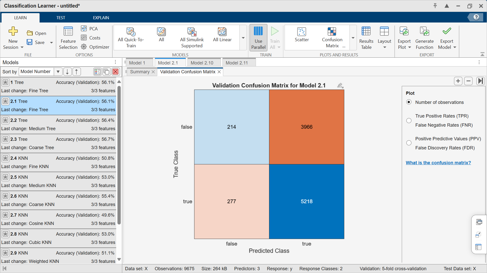

# Basket

Use MATLAB with Python to play with NBA data

[ELO](https://en.wikipedia.org/wiki/Elo_rating_system) race:

https://raw.githubusercontent.com/yanndebray/basket/refs/heads/main/nba_elo_race.mp4

<a name="beginToc"></a>

## Table of Contents
&emsp;&emsp;[Games](#games)
 
&emsp;&emsp;[Prep data](#prep-data)
 
&emsp;&emsp;[Classification](#classification)
 
<a name="endToc"></a>

**Resources**

-  [https://github.com/swar/nba\_api](https://github.com/swar/nba_api)  

## Games
```matlab
games = readtable("games-2015-2024.csv")
```
| |GAME_ID|GAME_DATE|MATCHUP|WL|PTS|PLUS_MINUS|TEAM|OPPONENT|
|:--:|:--:|:--:|:--:|:--:|:--:|:--:|:--:|:--:|
|1|21500002|2015-10-27|'CHI vs. CLE'|'W'|97|2|'CHI'|'CLE'|
|2|21500001|2015-10-27|'ATL vs. DET'|'L'|94|-12|'ATL'|'DET'|
|3|21500003|2015-10-27|'GSW vs. NOP'|'W'|111|16|'GSW'|'NOP'|
|4|21500014|2015-10-28|'PHX vs. DAL'|'L'|95|-16|'PHX'|'DAL'|
|5|21500015|2015-10-28|'POR vs. NOP'|'W'|112|18|'POR'|'NOP'|
|6|21500013|2015-10-28|'OKC vs. SAS'|'W'|112|6|'OKC'|'SAS'|
|7|21500005|2015-10-28|'BOS vs. PHI'|'W'|112|17|'BOS'|'PHI'|
|8|21500016|2015-10-28|'SAC vs. LAC'|'L'|104|-7|'SAC'|'LAC'|
|9|21500010|2015-10-28|'HOU vs. DEN'|'L'|85|-20|'HOU'|'DEN'|
|10|21500011|2015-10-28|'MEM vs. CLE'|'L'|76|-30|'MEM'|'CLE'|
|11|21500006|2015-10-28|'BKN vs. CHI'|'L'|100|-15|'BKN'|'CHI'|
|12|21500017|2015-10-28|'LAL vs. MIN'|'L'|111|-1|'LAL'|'MIN'|
|13|21500007|2015-10-28|'DET vs. UTA'|'W'|92|5|'DET'|'UTA'|
|14|21500004|2015-10-28|'ORL vs. WAS'|'L'|87|-1|'ORL'|'WAS'|

```matlab
% Initialize constants
K = 20;
HOME_EDGE = 100;

% Unique teams
teams = unique(games.TEAM);
elo = struct();

% Initialize Elo ratings
for i = 1:length(teams)
    team = teams{i};
    elo.(team) = 1500;
end

% Prepare records
records = [];

% Sort games by date
games = sortrows(games, 'GAME_DATE');

for i = 1:height(games)
    row = games(i, :);
    team = row.TEAM{1};
    opp  = row.OPPONENT{1};
    gid = row.GAME_ID;
    date = row.GAME_DATE;
    
    % Ensure both teams exist in struct
    if ~isfield(elo, tname), elo.(tname) = 1500; end
    if ~isfield(elo, oname), elo.(oname) = 1500; end

    % Elo before the game (add home edge)
    r_team = elo.(tname) + HOME_EDGE;
    r_opp  = elo.(oname);
    
    % Win or lose (1 or 0)
    y = strcmp(row.WL, 'W');
    
    % Store record
    record = table(...
        date, gid, ...
        {team}, {opp}, ...
        elo.(tname), elo.(oname), ...
        r_team - r_opp, y, ...
        'VariableNames', {'date','game_id', ...
                          'team', 'opponent', ...
                          'elo_pre', 'elo_opp_pre', ...
                           'elo_diff', 'win'});
    records = [records; record];

    % Update Elo ratings
    exp_t = 1 / (1 + 10^((r_opp - r_team)/400));
    exp_o = 1 / (1 + 10^((r_team - r_opp)/400));
    
    elo.(tname) = elo.(tname) + K * (y - exp_t);
    elo.(oname) = elo.(oname) + K * ((1 - y) - exp_o);
end

% Output final records
records
```
| |date|game_id|team|opponent|elo_pre|elo_opp_pre|elo_diff|win|
|:--:|:--:|:--:|:--:|:--:|:--:|:--:|:--:|:--:|
|1|2015-10-27|21500002|'CHI'|'CLE'|1500|1500|100|1|
|2|2015-10-27|21500001|'ATL'|'DET'|1.5072e+03|1.4928e+03|114.3974|0|
|3|2015-10-27|21500003|'GSW'|'NOP'|1.4940e+03|1.5060e+03|88.0402|1|
|4|2015-10-28|21500014|'PHX'|'DAL'|1.5015e+03|1.4985e+03|103.0780|0|
|5|2015-10-28|21500015|'POR'|'NOP'|1.4887e+03|1.5113e+03|77.3125|1|
|6|2015-10-28|21500013|'OKC'|'SAS'|1.4965e+03|1.5035e+03|92.9341|1|
|7|2015-10-28|21500005|'BOS'|'PHI'|1.5039e+03|1.4961e+03|107.7084|1|
|8|2015-10-28|21500016|'SAC'|'LAC'|1.5108e+03|1.4892e+03|121.6995|0|
|9|2015-10-28|21500010|'HOU'|'DEN'|1.4975e+03|1.5025e+03|94.9670|0|
|10|2015-10-28|21500011|'MEM'|'CLE'|1.4848e+03|1.5152e+03|69.6325|0|
|11|2015-10-28|21500006|'BKN'|'CHI'|1.4728e+03|1.5272e+03|45.6769|0|
|12|2015-10-28|21500017|'LAL'|'MIN'|1.4615e+03|1.5385e+03|23.0626|0|
|13|2015-10-28|21500007|'DET'|'UTA'|1.4509e+03|1.5491e+03|1.7370|1|
|14|2015-10-28|21500004|'ORL'|'WAS'|1.4608e+03|1.5392e+03|21.6370|0|

## Prep data
```matlab
% Feature matrix (X) and target vector (y)
X = records(:, {'elo_pre', 'elo_opp_pre', 'elo_diff'});
y = records.win;
```

```matlab
histogram(y)
```


## Classification
```matlab
classificationLearner
```

The models are overpredicting wins, probably because the dataset is unbalanced




